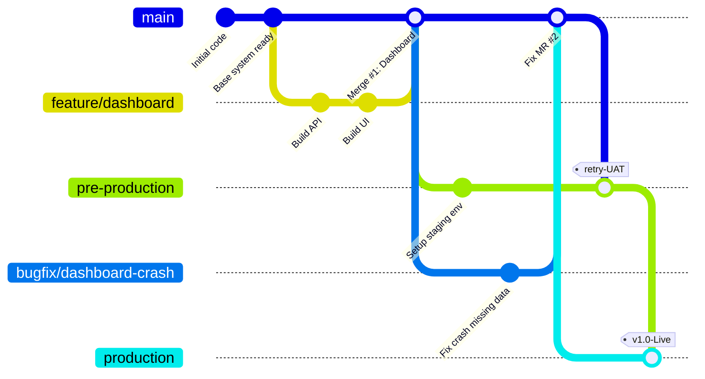

# Feature Branch Workflow

## 1. Tổng quan
Feature Branch Workflow không thực sự là một quy trình mới mẻ hay xa lạ, mà nó là **khái niệm nền tảng cốt lõi** sinh ra những mô hình phức tạp hơn sau này như Gitflow, GitHub Flow, GitLab Flow. 
Nguyên tắc của nó cực kỳ đơn giản: **Mọi công việc, dù là làm tính năng hay sửa lỗi, đều phải thực hiện trên một nhánh riêng biệt, không được sờ tay trực tiếp vào nhánh gốc `main` (hoặc `master`).** 

Feature Branch bọc gọn gẽ công việc, là hạt nhân để các mô hình khác (dùng qua Pull Request / Merge Request) xây đắp quanh nó.

## 2. Các điểm cốt lõi

1. **Giữ nhánh gốc trong sạch (Clean Main Branch):** Nhánh `main` là thánh địa, không ai vác cuốc vào đây đào đất cất nhà cả.
2. **Tách biệt rủi ro (Isolation):** Mỗi file sửa đổi đều bị giam lỏng ở nhánh con (`feature/*`, `bugfix/*`). Dev thích push commit gãy lòi 100 lần trong 5 ngày lên nhánh của mình ở server thoải mái, team vẫn an toàn.
3. **Mở ra khái niệm Pull Request/Merge Request:** Vì tính năng nằm gọn trong một nhánh độc lập, Team có thể gọi nhau vào trang quản lý (GitHub/GitLab) xem "Anh vừa code cái nhánh Giao diện Thanh Toán này, bọn mày vô đọc, nếu được thì cho anh Merge nó vào main". 
4. **Bỏ xó tính năng dễ dàng:** Đôi lúc Marketing báo tính năng bị hủy, Dev chẳng cần bận tâm nhổ đoạn này đoạn kia. Chỉ cần xóa bay nhánh con đó. Nhánh `main` nguyên si.

## 3. Sơ đồ hoạt động (Mermaid)



## 4. Các lệnh Git cơ bản của Feature Branch

**1. Tách nhánh từ Main thay vì sửa code bừa bãi**
```bash
git checkout main
# Quan trọng: Luôn lấy hàng mới nhất để bắt đầu tính năng
git pull origin main

# Tạo và chuyển sang nhánh tính năng
git checkout -b feature/login-module
```

**2. Quá trình làm việc một mình**
```bash
git add auth.py
git commit -m "Thêm hàm mã hóa mật khẩu"
git add view.html
git commit -m "Thiết kế form Login"

# Push nhánh tính năng của bạn lên kho chung (Remote)
git push -u origin feature/login-module
```

**3. Khá quen thuộc, sau đó bạn sẽ qua Web (GitHub/Bit/Gitlab...)* mở Pull Request để gọi review. Dưới đây là cách mô phỏng gộp thủ công Local nếu sếp báo "Code quá ngon merge đi".**
```bash
git checkout main
# Cập nhật xem có ai bỏ gì vào nhà chính lúc mình đi vắng không
git pull origin main

# Gộp nhánh tính năng vào nhà chính
git merge feature/login-module
git push origin main

# Xóa dấu vết 
git branch -d feature/login-module
```

## 5. Ưu điểm và Nhược điểm

**Ưu điểm:**
- **Triết lý tự phòng vệ:** Tránh tối đa xung đột trực tiếp trên codebase chung. Ai làm việc người nấy ở vương quốc của riêng mình cho xong.
- Cực kì uyển chuyển, linh hoạt. Bất kì ai trong thế giới Git (dù team mạnh team yếu) đều dùng cái gốc này (Vì thực tế GitHub flow cũng chính là cái nhánh mở rộng thêm CI/CD từ cái luồng này).

**Nhược điểm:**
- Nếu nhánh Feature sống "quá thọ" (2-3 tuần), dev không chủ động kéo (pull) nhánh `main` về update liên tục, khi Merge cuối cùng sẽ nổ xung đột lớn diện rộng gọi nôm na là **Merge Hell**. 
- Thiếu hụt công ước bảo vệ phiên bản như luồng *Gitflow* nếu dự án cần build nhiều bản đĩa mềm v1, v2.

## 6. Khi nào nên áp dụng?
- Thường là kiến thức vỡ lòng bắt buộc, nền móng khi bắt đầu tiếp cận DevOps. 
- Mọi mô hình công ty phần mềm Outsourcing / In-house trừ các công ty xài Trunk-Based, đều áp dụng Feature Branch. 
