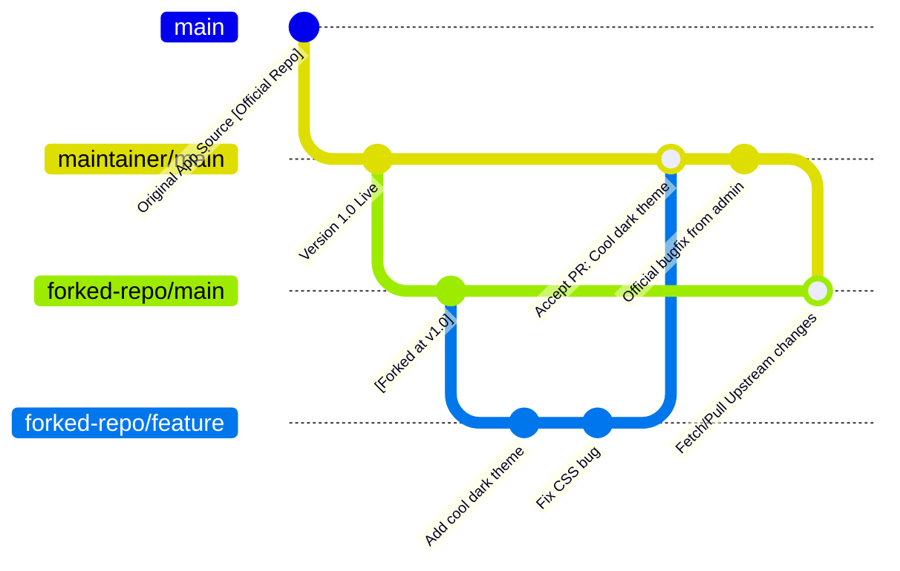

# Forking Workflow

## 1. Tổng quan
Forking Workflow là quy trình làm việc **đỉnh cao của bảo mật nguồn code**, sinh ra dành riêng cho thế giới **Open Source (Mã nguồn mở)** trên GitHub/GitLab.

Thay vì cho phép 100 người lại ghép code chung vào 1 kho Git công ty (như các mô hình khác: GitHub flow, Gitflow...), Forking Workflow giải quyết bài toán "Anh không tin mày". 
Người đóng góp (**Contributor**) KHÔNG CÓ QUYỀN ghi (Push) vào kho Git chính (Official Repo) của dự án. Thay vào đó, họ phải tự **Fork (Vượt cấp nhân bản đĩa/Nhân bản Repo)** toàn bộ dự án về tài khoản cá nhân của họ, sửa trên đó, và "Gửi Đơn Xin" (Pull Request) sang repo gốc.

## 2. Các điểm cốt lõi

1. **Official Repository (Kho chứa chính):** Chỉ Chủ dự án (Maintainer) mới có quyền đẩy code (push) lên đây.
2. **Personal / Forked Repository (Kho chứa cá nhân):** Bất cứ ai trên mạng (Contributor) cũng có thể ấn nút "Fork" trên giao diện Web (Không phải lệnh Git) để sao chép kho chứa chính về thành 1 kho y hệt thuộc quyền sở hữu của Contributor.
3. **Mô hình Khách - Chủ:** Khách sửa code ở kho Khách thoải mái bao nhiêu tuỳ thích (Pull, Push không giới hạn). Khi thấy ngon, Khách ấn nút Web gởi một **Pull Request** xuyên biên giới sang kho của Chủ. Chủ mở xem, nếu ưng thì Chủ gộp ngược code đó vào `main` của Chủ. Cực kì an toàn.

## 3. Sơ đồ hoạt động (Mermaid)



## 4. Các lệnh Git cơ bản của Forking Workflow

**1. Khởi tạo môi trường (Sau khi ấn nút Fork trên trang Web)**
```bash
# Clone CỦA BẠN (Forked repo) về máy tính cá nhân
git clone https://github.com/ToiLaAi/SieuDuAn.git
cd SieuDuAn

# RẤT QUAN TRỌNG: Cấu hình liên kết về kho GỐC (Official Repo)
# Đặt tên kho gốc là "upstream" (nguồn nước)
git remote add upstream https://github.com/ChuDuAn/SieuDuAn.git

# Xác nhận có 2 remote (origin=kho của mình, upstream=kho chủ)
git remote -v
```

**2. Quá trình làm việc (Đóng góp tính năng)**
```bash
# Đồng bộ hoá kho của mình với kho chủ (Đừng bao giờ quên bước này)
git checkout main
git pull upstream main

# Tuyệt đối không code trên nhánh main, tách nhánh mới
git checkout -b feature/dark-theme

# Code xong, commit
git add .
git commit -m "Bổ sung Giao diện Tối cho Trang chủ"

# Chỉ được phép Push lên Kho Của Mình (origin) 
git push -u origin feature/dark-theme
```

**3. Tạo Pull Request và Đồng bộ**
- Vào trang GitHub (Kho của bạn), ấn nút **Compare & Pull Request** và viết thư thuyết phục Chủ dự án cho gộp code.
- Nếu được gộp thành công, quay về Local xoá nhánh và kéo (pull) từ rễ.

```bash
git checkout main
# Kéo code mới nhất từ kho GỐC (Bao gồm cả code của bạn vừa được Chủ gộp)
git pull upstream main
# Đẩy code vừa Đồng bộ này cho Kho Của Bạn (server)
git push origin main
```

## 5. Ưu điểm và Nhược điểm

**Ưu điểm:**
- **An Toàn Tuyệt Đối (Security):** Tích hợp phân quyền vật lý (Physical Repo isolation). Code lỗi, nhảm nhí không bao giờ làm rác kho chính.
- Mở rộng quy mô đội phản ứng vô hạn (Bất kì người lạ nào trên trái đất cũng có thể tham gia sửa lỗi code cho bạn mà bạn chả cần phải set Permission hay invite account vào Repo chung).

**Nhược điểm:**
- Cấu hình ban đầu khá rối với Dev mới chạm ngõ Git (Phải loay hoay config `origin` vs `upstream`).
- Rất tốn bộ nhớ kho (Hàng nghìn người fork dự án bằng hàng nghìn cái Repo đầy đủ).
- Merge conflict (Xung đột) là điều khó tránh khi hàng trăm Contributor làm việc song song hàng năm trời trên hàng ngàn Fork.

## 6. Khi nào nên áp dụng?
- **Các dự án Open Source thần thánh:** Linux Kernel, ReactJS, VS Code, Kubernetes... đều dùng Forking Workflow.
- Các công ty phần mềm lớn (Uber, Google) cũng áp dụng mô hình này trong nội bộ công ty để các "Team A" muốn đóng góp bộ thư viện cho "Team B" thì dùng chiến thuật Fork - PR.
