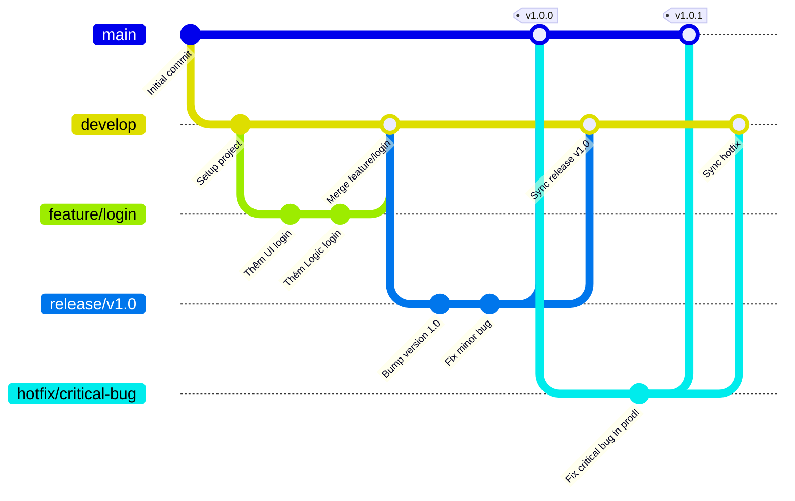

# Gitflow Workflow

## 1. Tổng quan
Gitflow là một workflow quản lý source code bằng cách sử dụng các nhánh một cách nghiêm ngặt, xoay quanh các vòng đời phát hành (release). Nó được Vincent Driessen giới thiệu lần đầu vào năm 2010.
Mô hình này không áp đảo việc tích hợp liên tục (CI) mà tập trung vào xây dựng các luồng phát hành rõ ràng, có phiên bản (version) cụ thể, thích hợp cho phần mềm truyền thống, ứng dụng mobile hoặc phần mềm doanh nghiệp.

## 2. Các loại nhánh (Branches) trong Gitflow

### 2.1. Nhánh chính (Tồn tại vĩnh viễn)
*   **`main` (hoặc `master`)**: Nhánh chứa lịch sử release chính thức. Code trên nhánh này TẤT CẢ đều ở trạng thái sẵn sàng để deploy lên môi trường Production. Các commit trên nhánh này thường được gắn tag phiên bản (ví dụ: `v1.0.0`, `v2.1.0`).
*   **`develop`**: Nhánh tích hợp các tính năng mới cho đợt release tiếp theo. Chứa toàn bộ lịch sử code đang được phát triển. Khi code trên `develop` ổn định và sẵn sàng cho một đợt phát hành, nó sẽ được gộp (merge) dần vào `main`.

### 2.2. Nhánh hỗ trợ (Chỉ tồn tại tạm thời)
*   **`feature/*`**: Dùng để phát triển các tính năng mới. Tách ra từ `develop` và merge lại vào `develop`.
*   **`release/*`**: Dùng để chuẩn bị cho một đợt phát hành Production mới. Tách ra từ `develop`. Ở nhánh này chỉ thực hiện fix bug nhỏ, thêm meta-data (version number, build date...). Khi đã chốt hạ, nhánh này được merge vào CẢ `main` (để release) VÀ `develop` (để đồng bộ các bug đã fix).
*   **`hotfix/*`**: Dùng để vá lỗi khẩn cấp trên Production. Tách ra trực tiếp từ `main`. Sau khi sửa xong, merge ngược lại vào CẢ `main` (cập nhật bản vá ra Production ngay lập tức với tag mới, ví dụ: `v1.0.1`) VÀ `develop` (rất quan trọng, để tránh lỗi này lập lại trong tương lai).

## 3. Sơ đồ hoạt động (Mermaid)



## 4. Các lệnh Git cơ bản của Gitflow

**1. Khởi tạo tính năng mới (Feature)**
```bash
git checkout develop
git checkout -b feature/my-feature

# Sau khi làm việc xong, merge về develop
git checkout develop
git merge feature/my-feature
git branch -d feature/my-feature
```

**2. Chuẩn bị Release (Release)**
```bash
git checkout develop
git checkout -b release/v1.2.0

# Sửa các bug nhỏ trong quá trình test
# Merge vào main và đánh tag
git checkout main
git merge release/v1.2.0
git tag -a v1.2.0 -m "Release version 1.2.0"

# Merge lại về develop để đồng bộ
git checkout develop
git merge release/v1.2.0
git branch -d release/v1.2.0
```

**3. Vá lỗi khẩn cấp (Hotfix)**
```bash
git checkout main
git checkout -b hotfix/fix-login-db

# Sau khi sửa lỗi
# Merge vào main và đánh tag patch version
git checkout main
git merge hotfix/fix-login-db
git tag -a v1.2.1 -m "Hotfix for login db issue"

# KHÔNG ĐƯỢC QUÊN merge về develop
git checkout develop
git merge hotfix/fix-login-db
git branch -d hotfix/fix-login-db
```

*(Lưu ý: Hiện nay có thể dùng công cụ tự động hóa `git flow cli` thao tác các nhánh này ngắn gọn hơn: `git flow feature start my-feature`, `git flow finish my-feature`)*

## 5. Ưu điểm và Nhược điểm

**Ưu điểm:**
- Quản lý phiên bản (Versioning) rạch ròi, giúp dễ dàng kiểm soát nhiều phiên bản code.
- Phân chia vai trò các nhánh rõ ràng, ai vào nhánh nào biết ngay nhiệm vụ nhánh đó.
- Sửa lỗi khẩn cấp (Hotfix) trên Production mà không bị ảnh hưởng bởi code tính năng mới chưa xong ở `develop`.

**Nhược điểm:**
- Luồng quá rườm rà, đồ sộ, làm chậm tiến độ giao hàng (delivery speed).
- Các nhánh `feature` nằm độc lập quá lâu dễ dẫn đến thảm họa "Merge Hell" (xung đột lằng nhằng lúc review code).
- Thừa thãi nếu áp dụng cho CI/CD hoặc làm Cloud / Web app, nơi cần deploy mỗi ngày.

## 6. Khi nào nên áp dụng?
*   Phần mềm đóng gói (Boxed software) có version cụ thể do người dùng tải về cài đặt (App Mobile, Desktop App, Game).
*   Sản phẩm có vòng đời phát hành chậm (vài tháng 1 bản release).
*   Sản phẩm yêu cầu bảo trì nhiều phiên bản cũ song song.
