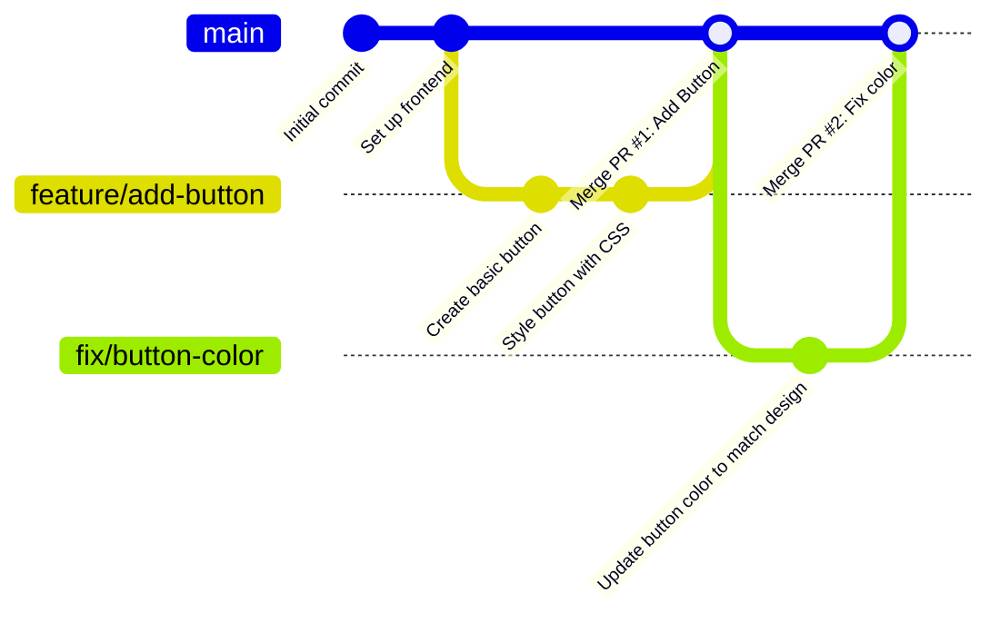

# GitHub Flow

## 1. Tổng quan
GitHub Flow là một vòng quản lý luồng Git tối giản do GitHub đề xuất, xoay quanh việc phát hành (deploy) liên tục (Continuous Deployment). 
Triết lý duy nhất của GitHub Flow là: **Mọi thứ tồn tại trên nhánh `main` đều ở trạng thái sẵn sàng để chạy trên môi trường thực tế (production).**

Mô hình này cắt bỏ hoàn toàn sự lằng nhằng của nhánh `develop` hay các nhánh Release/Hotfix, khiến nó trở thành đại xưng danh của CI/CD tốc độ cao.

## 2. Các bước cốt lõi
1. **Tạo nhánh (Create branch):** Từ `main`, tạo một nhánh mới (ví dụ: `feature/login-ui`, `bugfix/typo-header`) mang tính mô tả chức năng.
2. **Thêm thay đổi (Add commits):** Commit liên tục các thay đổi lên nhánh ở máy tính và push (đẩy lên remote server) thường xuyên. Bước này giúp nhận phản hồi sơ bộ hoặc mượn server test sớm (như Vercel Preview).
3. **Mở Pull Request (Open a PR):** Khi làm xong hoặc thậm chí là đang làm cần gọi người trợ giúp, hãy mở Pull Request (PR) để gọi đồng nghiệp vào kiểm tra code (Code Review).
4. **Thảo luận và sửa đổi (Discuss and review code):** Team sẽ bàn bạc, comment trên từng dòng code để đảm bảo tiêu chuẩn. Sau mỗi lần sửa chữa theo ý team, quy trình tự động kiểm thử (CI pipeline) chạy để tự động báo lỗi.
5. **Merge (Gộp nhánh):** Sau khi PR được duyệt bởi ít nhất 1-2 người, code test pass 100%, nhánh này sẽ được merge vào `main`.
6. **Deploy:** Code sau khi lọt vào `main` được hệ thống CI/CD tự động phát hành lên môi trường thực tế. 

## 3. Sơ đồ hoạt động (Mermaid)



## 4. Các lệnh Git cơ bản của GitHub Flow

**1. Khởi tạo tính năng (hoặc Bugfix)**
```bash
git checkout main
git pull origin main
# Tên nhánh phải mô tả công việc
git checkout -b feature/user-profile
```

**2. Quá trình làm việc liên tục**
```bash
git add profile.html
git commit -m "Thêm khung hiển thị người dùng"
git push -u origin feature/user-profile
```

**3. Hoàn thành và Mở Pull Request**
Lên trang Web GitHub (Giao diện đồ họa) để nhấp nút "Create Pull Request". Review xong thì nhấn nút "Merge". Cực kì hiếm khi dân chơi GitHub Flow gõ lệnh merge thủ công dưới local trừ khi PR sinh ra Conflict phức tạp cần xử lý tay.

**4. Dọn dẹp sau Merge**
```bash
git checkout main
git pull origin main
# Nhánh ở server đã bị xóa tự động (do web), giờ xóa nhánh local
git branch -d feature/user-profile
```

## 5. Ưu điểm và Nhược điểm

**Ưu điểm:**
- **Tối giản hóa quy trình:** Rất dễ học, không mệt mỏi suy nghĩ xem phải gộp vào nhánh nào (mọi nhánh đều quay lại `main`).
- **Tốc độ (Agility):** Rút ngắn "Feedback Loop" (vòng lặp phản hồi). Viết code buổi sáng, review đầu giờ chiều và code chễm chệ trên production trước lúc tan ca. Sinh ra dành riêng cho CI/CD.
- Thúc đẩy văn hóa **Code Review** thông qua Pull Request.

**Nhược điểm:**
- Mọi thứ ụp hết vào `main`. Phụ thuộc hoàn toàn vào hệ thống Kiểm thử Tự động (Automated Tests). Nếu test yếu, lỗi bung ra ngoài thực tế là chuyện hiển nhiên.
- Rất khó khăn để quản lý ứng dụng Desktop/Mobile có hỗ trợ nhiều phiên bản V1.0, V2.0 cùng lúc, vì GitHub Flow thiết kế chỉ duy nhất 1 luồng chính.
- Trong các team "khổng lồ", có quá nhiều PR dồn dập vào `main` cùng lúc sẽ gây xung đột dây chuyền.

## 6. Khi nào nên áp dụng?
*   Web framework / SaaS / Backend Service (Deploy và release liên tục, vài API mới 1 ngày).
*   Các dự án Agile có quy trình CI/CD cực xịn để bắt lỗi tự động.
*   Các dự án startup/Agile yêu cầu thử nghiệm siêu ngắn để test thị trường.
