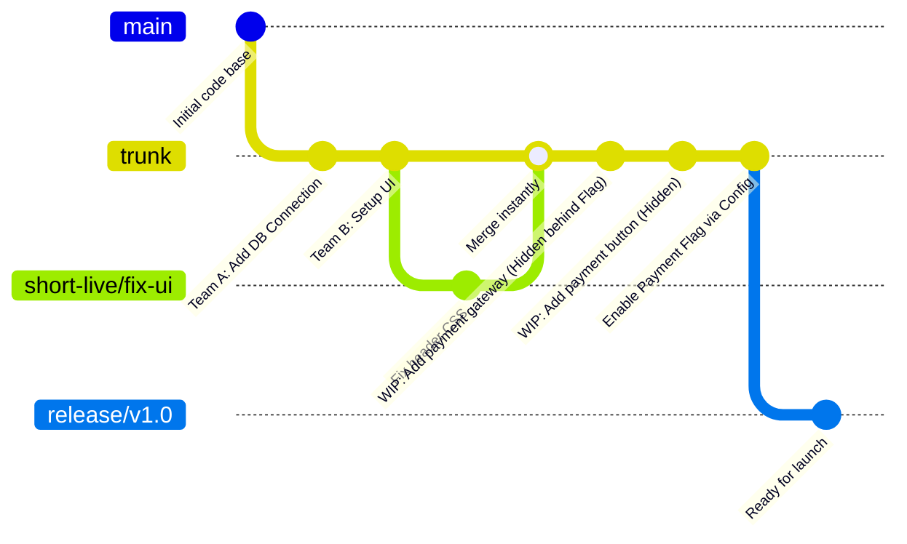

# Trunk-Based Development (TBD)

## 1. Tổng quan

Trunk-Based Development (TBD) là linh hồn của triết lý DevOps hiện đại (được áp dụng mạnh mẽ tại Google, Facebook, Netflix). Trong mô hình này, khái niệm "Nhánh" (Branch) gần như bị xóa bỏ hoặc bị ép vòng đời xuống mức cực ngắn (vài giờ đến 1 ngày).
Tất cả bộ não lập trình viên trong team đều **commit trực tiếp vào một nhánh gốc duy nhất gọi là `trunk`** (thường là nhánh `main` hoặc `master`). Không có chuyện "tu đắc đạo" 2 tuần trên một nhánh rồi mới ghép code. TBD sinh ra để tiêu diệt khái niệm "Merge Hell" (Ác mộng xung đột code).

## 2. Các nguyên tắc tối cao

1. **Commit nhỏ và cực kỳ thường xuyên:** TBD biến việc đẩy code (push) thành hành động hàng ngày (nhiều lần mỗi ngày). Nhánh chỉ tồn tại vài giờ, xong việc, đẩy ngay lên luồng chính (`trunk`).
2. **Feature Flags (Công tắc tính năng):** Vì mọi thứ đều gom vào `trunk`, nhưng lỡ tính năng đó code chưa xong thì sao? Team thiết lập một biến ẩn (Feature Flag) bọc quanh đoạn code đó. Lúc deploy, đoạn code mới đã lên server nhưng bị tắt (chỉ developer thấy), user không hề hay biết cho đến khi bấm bật công tắc.
3. **Automated Testing là Bắt Buộc (Mạng sống):** Nhánh chính luôn ở trạng thái "Deploy-Ready". Nếu có test nào "fail", "broken", cả hệ thống sập báo động, developer phải lập tức ưu tiên bỏ mọi việc ra sửa nhánh chính ngay lập tức.
4. **Code Review Đồng Bộ (hoặc Pair-Programming/Mob-Programming):** Thay vì đợi Pull Request hàng tuần, review code phải diễn ra liên tục song song trong ngày (có thể 2 dev ngồi cùng 1 góc gõ tay liền code - Pair Programming).

## 3. Sơ đồ hoạt động (Mermaid)



## 4. Các lệnh Git cơ bản của TBD

TBD gần như không có sự xa lạ trong Git, điểm mấu chốt là **Sự liên tục**.

### 1. Liên tục cập nhật (Sáng sớm lúc đi làm)

```bash
git checkout trunk 
git pull --rebase origin trunk
```

### 2. Tạo một thay đổi nháp, push (Trong vòng 2 giờ)

```bash
git checkout trunk
# Làm việc, làm việc, chỉ 2 giờ!
git commit -am "WIP: Giao diện thanh toán dưới Flag"
git push origin trunk
```

**Lưu ý khi có Conflict nhỏ do người khác cũng push thẳng nhánh chính:**

```bash
# Lấy file server về đắp đè, file của mình nổi lên trên
git pull --rebase origin trunk
# Có lỗi đỏ dập tay, giải quyết xong:
git rebase --continue
git push origin trunk
```

## 5. Ưu điểm và Nhược điểm

**Ưu điểm:**

- **Triệt tiêu hoàn toàn rủi ro Merge Hell:** Xung đột code nếu xảy ra chỉ giới hạn ở mức "vài dòng" do chu kì tích hợp diễn ra siêu nhỏ (daily - hàng ngày).
- **Tuyệt đối tương thích với CI/CD (Agile / DevOps Max cấp độ):** Tích hợp liên tục ở tầm vi mô, phát hành phần mềm liên tục 50 lần 1 ngày.
- **Tính khả thị đồng đội cao:** Do ai cũng phải bám rễ vào một nhánh, team nhận ra sự đứt gãy kiến trúc sớm nhất.

**Nhược điểm:**

- **Áp lực cao, Yêu cầu kỹ năng cực mạnh:** Cách làm này coi Lập Trình Viên là các cao thủ, có ý thức test kĩ từ máy mình (Kĩ năng viết Unit Test/Integration Test phải rất xịn).
- Đòi hỏi xây dựng hệ thống hệ sinh thái (Feature Toggle/Flag Dashboard) bài bản vì tính năng dở dang sẽ đẩy lên môi trường Production.
- Sẽ là thảm họa đại hồng thủy với những team "gõ là hỏng", junior nhiều, hoặc QA (QC) rườm rà. Chỉ 1 ông Junior push code lậu, nhánh chính hỏng lập tức, cả công ty ngưng việc.

## 6. Khi nào nên áp dụng?

- Các cỗ máy DevOps cấp cứu: BigTech (Google, Netflix, Facebook, Github) những nơi mà "Deploy vài nghìn lần một ngày" không phải câu nói đùa.
- Extreme Programming (XP), các team Aglie trưởng thành, tinh gọn, lập trình theo cặp.
- Nền tảng Backend Microservices / SaaS cấu trúc cao, mạnh kiểm thử tự động, ít phụ thuộc cấu trúc khép kín.
